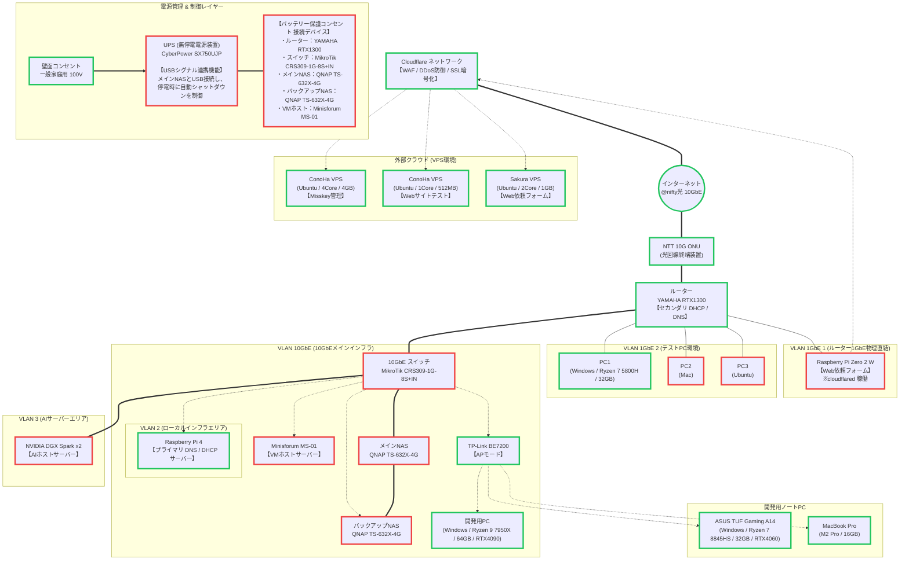
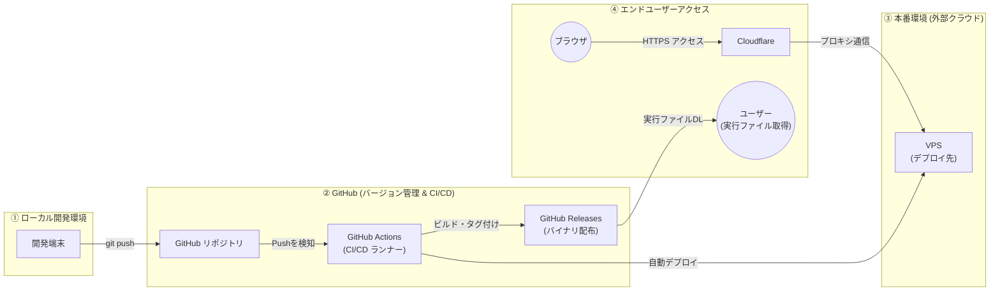

# FRICKのエンジニアリング知識

FRICKのエンジニアリングで**できること**と、それに伴う**必要な知識**を整理するためのリポジトリです。

## このリポジトリの目的

- 自分が実際に行うエンジニアリング活動の範囲を言語化し、把握しやすくする
- 領域ごとのスキル・前提知識をドキュメント化し、自己学習や振り返りの指針にする
- メモやリンクの散在を減らし、自分用の参照入口を一つにまとめる

## コンテンツ構成（案）

以下のような章立てで追記・分割していく想定です。必要に応じてディレクトリや別ファイルに切り出してください。

| 領域 | できることの例 | 必要な知識の例 |
|------|------------------|----------------|
| ソフトウェア開発 | 設計、実装、レビュー、リリース | 言語・フレームワーク、Git、テスト |
| インフラ・運用 | デプロイ、監視、インシデント対応 | クラウド、ネットワーク、SRE の考え方 |
| 品質・セキュリティ | テスト戦略、脆弱性対応 | セキュリティ基礎、コンプライアンス |
| データ | パイプライン、分析基盤 | SQL、データモデリング、プライバシー |

※ 上表はプレースホルダです。自分の環境・関心に合わせて書き換えてください。

## 自宅インフラ構成

自宅ネットワーク・サーバー・クラウドの現状構成です。図中の枠線色は導入状況を示します。

| 枠線色 | 意味 |
|--------|------|
| 緑 | 購入・準備済み |
| 赤 | 未購入 |

## CI/CD パイプライン

ローカル開発から GitHub Actions 経由のデプロイ、およびエンドユーザーへのアクセスまでの流れです。

---

*この README は初期テンプレートです。進行に合わせてセクションを増やしたり、別リポジトリへのリンクを足したりしてください。*
