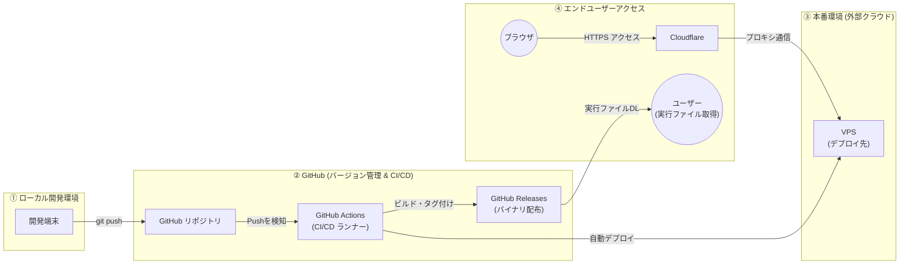

# CI/CD パイプライン

ローカル開発から GitHub Actions 経由のデプロイ、およびエンドユーザーへのアクセスまでの流れです。

## フロー図

## ステージ概要

| ステージ | 内容 |
|----------|------|
| ① ローカル開発 | 開発端末での実装・コミット |
| ② GitHub | Push 検知 → CI ビルド → Releases へのバイナリ配布 |
| ③ 本番環境 | VPS への自動デプロイ |
| ④ エンドユーザー | Cloudflare 経由の HTTPS アクセス、または Releases からの実行ファイル取得 |

## 技術メモ

<!-- ワークフロー定義、デプロイ手順、環境変数、シークレット管理など詳細はここに追記 -->
