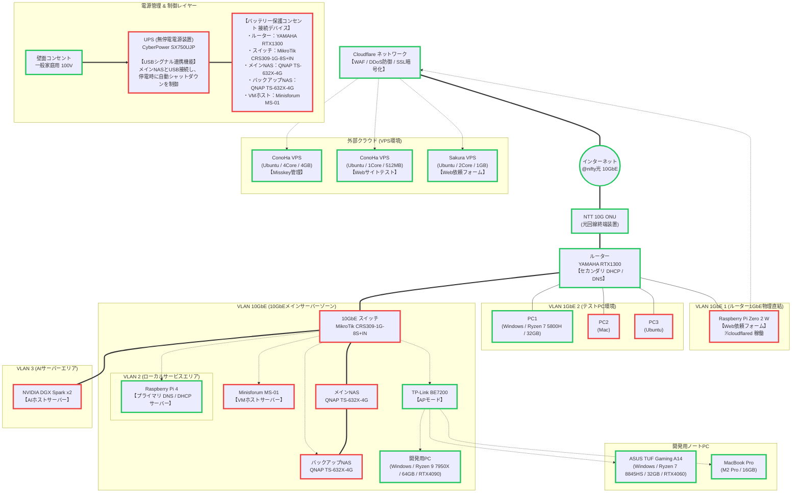

# 自宅ネットワーク構成

自宅ネットワーク・サーバー・クラウドの現状構成です。

## 構成図

図中の枠線色は導入状況を示します。

| 枠線色 | 意味 |
|--------|------|
| 緑 | 購入・準備済み |
| 赤 | 未購入 |

## ゾーン概要

| ゾーン | 役割 |
|--------|------|
| 外部クラウド (VPS) | Misskey、Webサイトテスト、依頼フォームなどの公開サービス |
| VLAN 1GbE 1 | cloudflared 経由のトンネル接続（Raspberry Pi Zero 2 W） |
| VLAN 1GbE 2 | マルチOS テスト環境（Windows / Mac / Ubuntu） |
| VLAN 10GbE | メインサーバー群（NAS、VMホスト、開発用PC） |
| VLAN 2 | ローカル DNS / DHCP（Raspberry Pi 4） |
| VLAN 3 | AI ホストサーバー（NVIDIA DGX Spark） |
| 電源管理 | UPS による停電時自動シャットダウン制御 |

## 技術メモ

<!-- デバイス設定、VLAN 番号、IP レンジ、DNS レコードなど詳細はここに追記 -->
