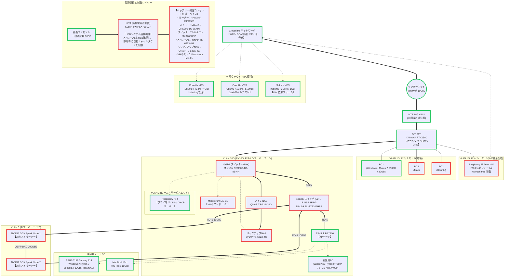

# 自宅ネットワーク構成

自宅ネットワーク・サーバー・クラウドの現状構成です。

## 構成図

図中の枠線色は導入状況を示します。

| 枠線色 | 意味 |
|--------|------|
| 緑 | 購入・準備済み |
| 赤 | 未購入 |

```mermaid
graph TD
    %% 外部ネットワーク・クラウド・コアルーター
    CF["Cloudflare ネットワーク<br>【WAF / DDoS防御 / SSL暗号化】"]
    WAN(("インターネット<br>@nifty光 10GbE"))
    ONU["NTT 10G ONU<br>(光回線終端装置)"]
    RTX1300["ルーター<br>YAMAHA RTX1300<br>【セカンダリ DHCP / DNS】"]

    %% 【外部クラウド VPS環境】
    subgraph VPS_Zone ["外部クラウド (VPS環境)"]
        VPS_Conoha_1["ConoHa VPS<br>(Ubuntu / 4Core / 4GB)<br>【Misskey管理】"]
        VPS_Conoha_2["ConoHa VPS<br>(Ubuntu / 1Core / 512MB)<br>【Webサイトテスト】"]
        VPS_Sakura["Sakura VPS<br>(Ubuntu / 2Core / 1GB)<br>【Web依頼フォーム】"]
    end

    %% Cloudflareを通じたルーティング・紐づけ
    CF -.-> VPS_Conoha_1
    CF -.-> VPS_Conoha_2
    CF -.-> VPS_Sakura

    CF === WAN
    WAN === ONU
    ONU === RTX1300

    %% 【VLAN 1GbE 1 系統】ルーターから物理隔離
    subgraph VLAN_1GbE_1 ["VLAN 1GbE 1 (ルーター1GbE物理直結)"]
        RPi_Zero["Raspberry Pi Zero 2 W<br>【Web依頼フォーム】<br>※cloudflared 稼働"]
    end
    RTX1300 --- RPi_Zero
    RPi_Zero -.-> CF

    %% 【VLAN 1GbE 2 系統】テストPC環境
    subgraph VLAN_1GbE_2_Zone ["VLAN 1GbE 2 (テストPC環境)"]
        PC_1["PC1<br>(Windows / Ryzen 7 5800H / 32GB)"]
        PC_2["PC2<br>(Mac)"]
        PC_3["PC3<br>(Ubuntu)"]
    end
    RTX1300 --- PC_1
    RTX1300 --- PC_2
    RTX1300 --- PC_3

    %% 【開発用ノートPC 系統】
    subgraph Dev_Laptop_Zone ["開発用ノートPC"]
        PC_ASUS["ASUS TUF Gaming A14<br>(Windows / Ryzen 7 8845HS / 32GB / RTX4060)"]
        PC_MBP["MacBook Pro<br>(M2 Pro / 16GB)"]
    end

    %% 【VLAN 10GbE 系統】10GbEメインサーバーゾーン
    subgraph VLAN_10GbE_Zone ["VLAN 10GbE (10GbEメインサーバーゾーン)"]
        CRS309["10GbE スイッチ (SFP+)<br>MikroTik CRS309-1G-8S+IN"]
        SX3206["10GbE スイッチ (L2+ / RJ45 / SFP+)<br>TP-Link TL-SX3206HPP"]
        QNAP1["メインNAS<br>QNAP TS-632X-4G"]
        QNAP2["バックアップNAS<br>QNAP TS-632X-4G"]
        MS01["Minisforum MS-01<br>【VMホストサーバー】"]
        BE7200["TP-Link BE7200<br>【APモード】"]
        PC_Dev["開発用PC<br>(Windows / Ryzen 9 7950X / 64GB / RTX4090)"]

        %% VLAN_10GbEの配下にさらにDNSを配置
        subgraph VLAN_2 ["VLAN 2 (ローカルサービスエリア)"]
            RPi_4["Raspberry Pi 4<br>【プライマリ DNS / DHCPサーバー】"]
        end
    end

    %% 【VLAN 3 系統】AIサーバー環境
    subgraph VLAN_3_Zone ["VLAN 3 (AIサーバーエリア)"]
        DGX1["NVIDIA DGX Spark Node 1<br>【AIホストサーバー】"]
        DGX2["NVIDIA DGX Spark Node 2<br>【AIホストサーバー】"]
    end

    %% VLAN_10GbE 内部およびノートPC類の物理・無線接続
    RTX1300 === CRS309
    CRS309 === QNAP1
    CRS309 -.-> QNAP2
    CRS309 -.-> MS01
    CRS309 ===|"SFP+"| SX3206
    CRS309 -.-> RPi_4

    SX3206 ===|"RJ45 10GbE"| DGX1
    SX3206 ===|"RJ45 10GbE"| DGX2
    SX3206 ===|"RJ45"| BE7200

    %% DGX Spark ノード間 ConnectX-7 直結（200GbE 計算網）
    DGX1 ===|"QSFP DAC 200GbE"| DGX2

    BE7200 -.-> PC_Dev
    BE7200 -.-> PC_ASUS
    BE7200 -.-> PC_MBP

    %% NAS間の直結専用線
    QNAP1 === QNAP2

    %% 電源・制御の管理
    subgraph Power_Management ["電源管理 & 制御レイヤー"]
        direction LR
        Wall["壁面コンセント<br>一般家庭用 100V"] ===> UPS["UPS (無停電電源装置)<br>CyberPower SX750UJP<br><br>【USBシグナル連携機能】<br>メインNASとUSB接続し、停電時に自動シャットダウンを制御"]
        UPS === P1["【バッテリー保護コンセント 接続デバイス】<br>・ルーター：YAMAHA RTX1300<br>・スイッチ：MikroTik CRS309-1G-8S+IN<br>・スイッチ：TP-Link TL-SX3206HPP<br>・メインNAS：QNAP TS-632X-4G<br>・バックアップNAS：QNAP TS-632X-4G<br>・VMホスト：Minisforum MS-01"]
    end

    %% ノード（デバイス）自体の外枠カラー指定（緑：準備・購入済 / 赤：未購入）
    %% 購入・準備済み（緑枠）
    style CF stroke:#22c55e,stroke-width:4px
    style WAN stroke:#22c55e,stroke-width:4px
    style ONU stroke:#22c55e,stroke-width:4px
    style RTX1300 stroke:#22c55e,stroke-width:4px
    style PC_1 stroke:#22c55e,stroke-width:4px
    style PC_ASUS stroke:#22c55e,stroke-width:4px
    style PC_MBP stroke:#22c55e,stroke-width:4px
    style BE7200 stroke:#22c55e,stroke-width:4px
    style PC_Dev stroke:#22c55e,stroke-width:4px
    style Wall stroke:#22c55e,stroke-width:4px
    style RPi_4 stroke:#22c55e,stroke-width:4px
    style VPS_Conoha_1 stroke:#22c55e,stroke-width:4px
    style VPS_Conoha_2 stroke:#22c55e,stroke-width:4px
    style VPS_Sakura stroke:#22c55e,stroke-width:4px

    %% 未購入（赤枠）
    style RPi_Zero stroke:#ef4444,stroke-width:4px
    style PC_2 stroke:#ef4444,stroke-width:4px
    style PC_3 stroke:#ef4444,stroke-width:4px
    style UPS stroke:#ef4444,stroke-width:4px
    style P1 stroke:#ef4444,stroke-width:4px
    style CRS309 stroke:#ef4444,stroke-width:4px
    style SX3206 stroke:#ef4444,stroke-width:4px
    style QNAP1 stroke:#ef4444,stroke-width:4px
    style QNAP2 stroke:#ef4444,stroke-width:4px
    style MS01 stroke:#ef4444,stroke-width:4px
    style DGX1 stroke:#ef4444,stroke-width:4px
    style DGX2 stroke:#ef4444,stroke-width:4px
```

## ゾーン概要

| ゾーン | 役割 |
|--------|------|
| 外部クラウド (VPS) | Misskey、Webサイトテスト、依頼フォームなどの公開サービス |
| VLAN 1GbE 1 | cloudflared 経由のトンネル接続（Raspberry Pi Zero 2 W） |
| VLAN 1GbE 2 | マルチOS テスト環境（Windows / Mac / Ubuntu） |
| VLAN 10GbE | メインサーバー群。SFP+ は CRS309、RJ45 は TL-SX3206HPP で収容 |
| VLAN 2 | ローカル DNS / DHCP（Raspberry Pi 4） |
| VLAN 3 | AI ホストサーバー（NVIDIA DGX Spark Node 1 / Node 2）。10GbE RJ45 は管理網、QSFP はノード間計算網 |
| 電源管理 | UPS による停電時自動シャットダウン制御 |

## 10GbE スイッチの役割

| スイッチ | 役割 | ポート |
|----------|------|--------|
| MikroTik CRS309-1G-8S+IN | SFP+ コア。ルーター、NAS、VMホスト、SX3206 上りを収容 | SFP+ ×8、1GbE RJ45 ×1 |
| TP-Link TL-SX3206HPP | L2+ マネージド。DGX Spark と BE7200 を RJ45 で収容し、VLAN 分離 | 10GBASE-T ×4（PoE++）、SFP+ ×2 |

CRS309 は SFP+ 中心のため、10GBASE-T（RJ45）機器は TL-SX3206HPP に接続する。2 台は SFP+ で上り接続する。

## ポート割当（購入検討）

### TP-Link TL-SX3206HPP

JetStream L2+ マネージド 10GbE スイッチ。RJ45 は 100M / 1G / 2.5G / 5G / 10G 自動ネゴシエーション。各 RJ45 は PoE++（IEEE 802.3bt、最大 60 W/ポート、予算 200 W）対応。802.1Q VLAN でポート単位にゾーンを分けられる。

| ポート | 種別 | 接続先 | 備考 |
|--------|------|--------|------|
| RJ45 1 | 10GBASE-T | NVIDIA DGX Spark Node 1 | VLAN 3。PoE はオフ |
| RJ45 2 | 10GBASE-T | NVIDIA DGX Spark Node 2 | VLAN 3。PoE はオフ |
| RJ45 3 | 10GBASE-T | TP-Link BE7200 | VLAN 10GbE。AP モード |
| RJ45 4 | 10GBASE-T | 予備 | |
| SFP+ 1 | SFP+ | MikroTik CRS309-1G-8S+IN | 上りトランク（DAC 想定） |
| SFP+ 2 | SFP+ | 予備 | |

### MikroTik CRS309-1G-8S+IN

| ポート | 種別 | 接続先 | 備考 |
|--------|------|--------|------|
| SFP+ | SFP+ | YAMAHA RTX1300 | コアルーター上り |
| SFP+ | SFP+ | QNAP TS-632X-4G（メイン） | |
| SFP+ | SFP+ | QNAP TS-632X-4G（バックアップ） | |
| SFP+ | SFP+ | Minisforum MS-01 | |
| SFP+ | SFP+ | TP-Link TL-SX3206HPP | SX3206 の SFP+ 1 へ |
| 1GbE RJ45 | RJ45 | Raspberry Pi 4 | プライマリ DNS / DHCP |

### NVIDIA DGX Spark（Node 1 / Node 2）

各ノードは 10GbE RJ45 と ConnectX-7 QSFP ×2（背面 左 = Port 0、右 = Port 1、各最大 200GbE）を持つ。2 ノード構成では 200GbE スイッチは使わず、QSFP DAC で直結する。同一側ポート同士（両方左、または両方右）を接続する。1 本で 200GbE 相当。2 本接続時は両ポートに IP を割り当てる。

| ノード | ポート | 種別 | 接続先 | 用途 |
|--------|--------|------|--------|------|
| Node 1 | RJ45 | 10GbE | TL-SX3206HPP RJ45 1 | 管理 / 通常通信（NAS、インターネット） |
| Node 1 | QSFP Port 0（左） | ConnectX-7 200GbE | Node 2 QSFP Port 0（左） | ノード間計算網（NCCL / RDMA / RoCE） |
| Node 1 | QSFP Port 1（右） | ConnectX-7 200GbE | 予備 | 2 本目 DAC で追加リンク可 |
| Node 2 | RJ45 | 10GbE | TL-SX3206HPP RJ45 2 | 管理 / 通常通信 |
| Node 2 | QSFP Port 0（左） | ConnectX-7 200GbE | Node 1 QSFP Port 0（左） | ノード間計算網（NCCL / RDMA / RoCE） |
| Node 2 | QSFP Port 1（右） | ConnectX-7 200GbE | 予備 | 2 本目 DAC で追加リンク可 |

ケーブルは QSFP112 または QSFP56 のパッシブ DAC（200GbE）。SX3206 / CRS309 には接続しない。

## 技術メモ

TL-SX3206HPP は L2+ マネージドのため、DGX Spark（VLAN 3）と BE7200（VLAN 10GbE）を同一筐体で分離できる。CRS309 との SFP+ 上りはトランクとし、双方で同一 VLAN を通す。

開発用PCおよびノートPCは BE7200（AP モード）配下。SX3206 の RJ45 には直接接続しない。

ConnectX-7 QSFP 直結は 10GbE 管理網とは独立した L2 である。計算トラフィックは QSFP、SSH / パッケージ更新 / NAS アクセスは RJ45 に分離する。

DGX Spark および BE7200 は AC 電源のため、SX3206 の PoE++ は当面オフとする。

<!-- デバイス設定、VLAN 番号、IP レンジ、DNS レコードなど詳細はここに追記 -->
